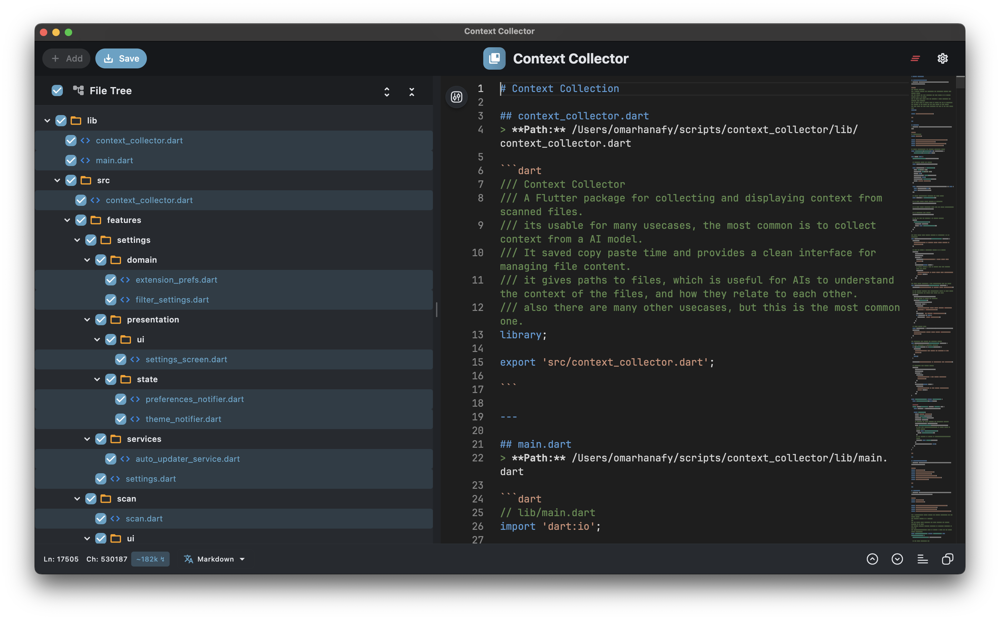

<div align="center">

# Context Collector

</div>

<p align="center">
  
</p>

> **Combine files & folders into a clean, AI-ready text bundle — powered by Flutter and Monaco Editor.**

Context Collector is a lightweight desktop app (macOS • Windows • Linux) that lets you drag-and-drop source files, logs, configurations, or entire directories and outputs a neatly annotated document.  
Every chunk includes full file paths and metadata, making it ideal for working smoothly with large-language models (LLMs) without the hassle of manual copying and pasting.

<p align="center">
  
</p>

---

## 🖥️ Typical Workflow

<p align="center">
  
</p>

1. **Drag & drop** files or directories onto the drop zone.
2. **Toggle** files to include/exclude from your combined context.
3. **Review & edit** the assembled content inside the Monaco editor.
4. **Copy** your merged content instantly.

> Tip: Head to *Settings → Extensions* to exclude noisy logs or add specialized formats (`.bert`, `.fish`, etc.).
 

---

## ✨ Key Features

| Capability                       | What it means for you                                                                                      |
|----------------------------------|------------------------------------------------------------------------------------------------------------|
| **Drag‑and‑drop everything**     | Drop individual files or entire directories; nested files are discovered automatically.                    |
| **250+ extensions supported**    | Built‑in support for code, logs, configs, docs, data & more — easily add your own custom extensions.       |
| **Monaco editor inside Flutter** | Enjoy syntax highlighting, multi‑cursor editing, Vim/IntelliJ/VS Code keybindings, themes, and word-wrap.  |
| **Live statistics**              | Line, character, cursor, and selection counts update in real-time—ideal for managing prompt token budgets. |
| **Quick copy/export**            | Copy merged context to clipboard with one click.                              |
| **Three‑way merge helper**       | Built‑in diff & merge engine handles *base ← local → remote* changes programmatically.                     |
| **Extensible APIs**              | Integrate the toolkit into your Flutter apps or automate assembly using Dart scripts.                      |

<p align="center">
  
</p>

---

## 🚀 Getting Started

### Option 1: Pre-built app (Recommended)

1. Go to [**Releases**](https://github.com/YOUR_USERNAME/YOUR_REPOSITORY/releases) and download the latest ZIP/DMG/EXE.
2. Unzip and run—zero setup required.

### Option 2: Build from source (Flutter 3.22+)

```bash
git clone https://github.com/YOUR_USERNAME/YOUR_REPOSITORY.git
cd YOUR_REPOSITORY
flutter pub get

# Enable desktop support if not already enabled
flutter config --enable-macos-desktop --enable-windows-desktop --enable-linux-desktop

# Run or build
flutter run  # or flutter build macos / windows / linux
```

---

## 🛠️ Configuration Highlights

* **Editor presets**: Beginner, Developer, Power User, Accessibility.
* **Keybinding presets**: VS Code (default), IntelliJ/WebStorm, Vim, Emacs—or load your custom JSON map.
* **Theme support**: Comes bundled with VS Light/Dark, One Dark Pro, and HC Black. Easily import additional VS Code themes.
* **Customizable extension catalog**: Quickly enable or disable formats or add custom file-to-category mappings.

---

## 📌 Why Context Collector?

| Problem                                                 | Context Collector's solution                                                                |
|---------------------------------------------------------|---------------------------------------------------------------------------------------------|
| *"ChatGPT keeps asking 'where's that widget defined?'"* | Bundles related Dart, Swift, HTML, etc., files into one cohesive, prompt-ready bundle.      |
| *"Sharing repro steps means pasting multiple logs."*    | Drag your entire `logs` directory; text files merge automatically and binaries are skipped. |
| *"Losing track of copied files."*                       | Path headers and file-size indicators clearly organize your context.                        |
| *"Long prompts blow up my token budget."*               | Quickly toggle files on/off or collapse content to control token usage.                     |

---

## 🔮 Roadmap

* 🔍 **Full-text search** across merged content within Monaco.
* 🗂️ Git repository crawler (honors `.gitignore` rules).
* 📟 CLI exporter for CI and prompt-engineering automation.
* 🧩 Plugin system for custom transformations (Markdown→HTML, etc.).

Have an idea? [Open an issue](../../issues) or join our Discord!

---

## 🤝 Contributing

1. Fork the repo & create a feature branch (`git checkout -b feat/my-feature`)
2. Before committing, run `flutter analyze && dart format .`
3. Follow **Conventional Commits** style for commit messages.
4. Submit your PR. We'll squash-merge and credit you!

> New to Flutter? Look for issues labeled **good-first-issue** for extra guidance.

---

## 📄 License

Context Collector is open-source software licensed under the **MIT License**—see [LICENSE](LICENSE).

© 2025 Omar Hanafy & community contributors.

---

## 🙏 Acknowledgements

* [Flutter](https://flutter.dev) & [Dart](https://dart.dev)
* [Monaco Editor](https://github.com/microsoft/monaco-editor)
* [`dart_helper_utils`](https://pub.dev/packages/dart_helper_utils) & [`flutter_helper_utils`](https://pub.dev/packages/flutter_helper_utils)
* Everyone who stars, contributes code, or files an issue ❤️

